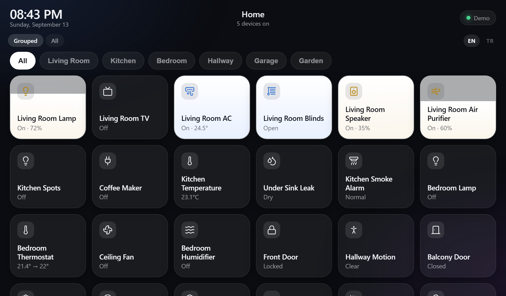
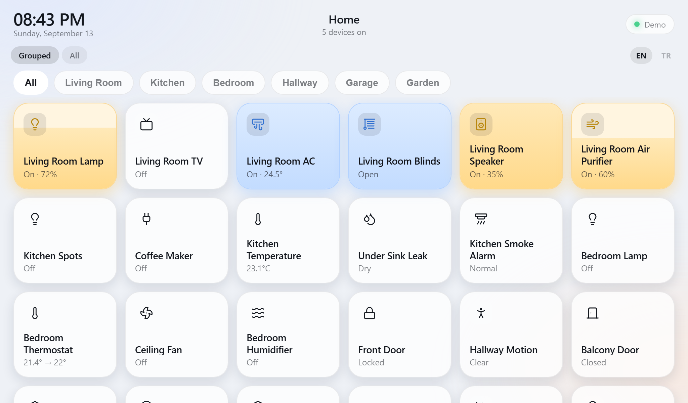
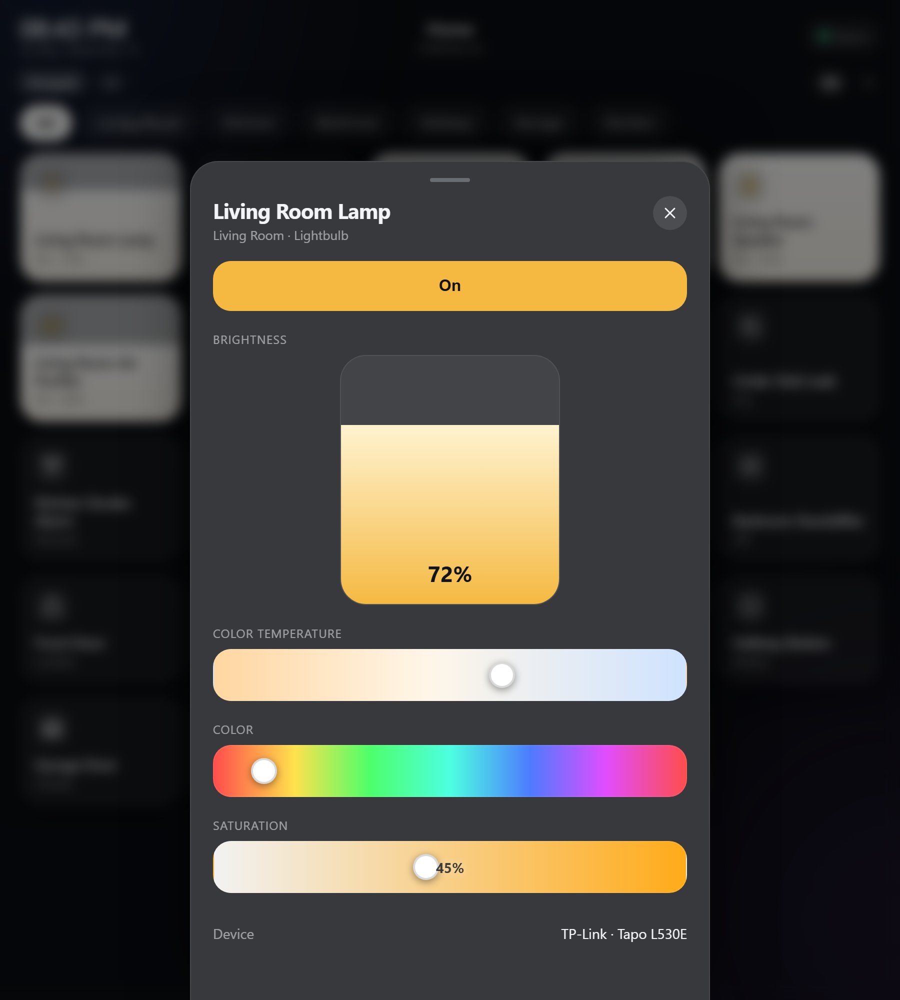
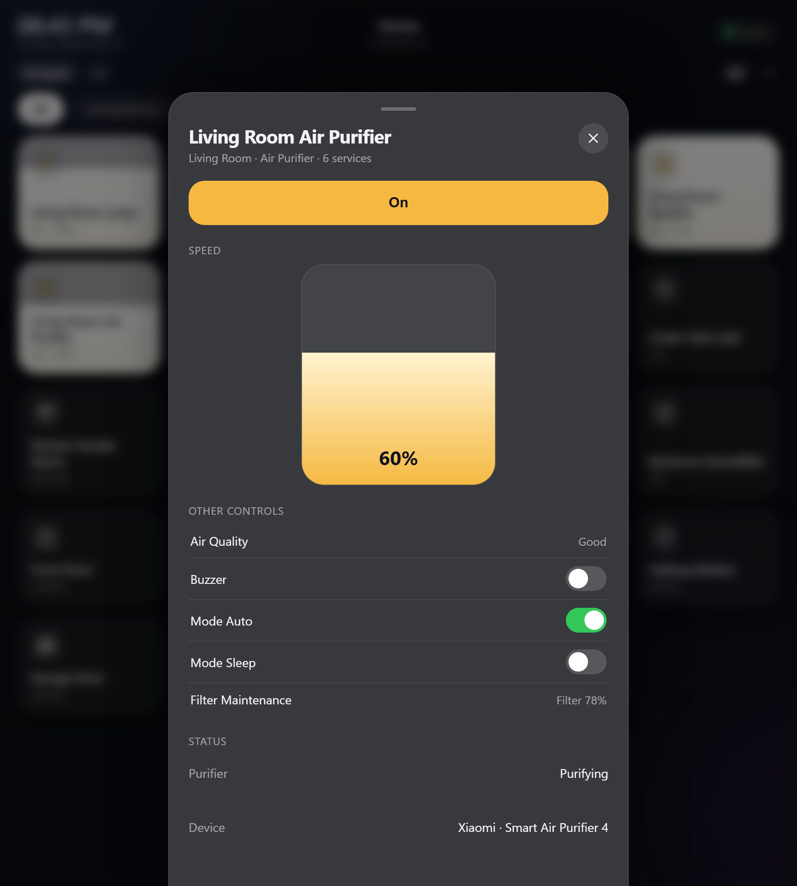
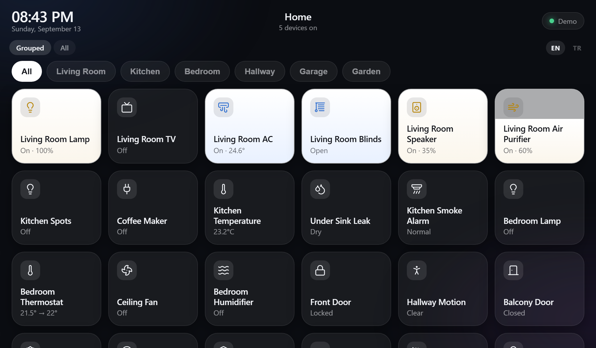
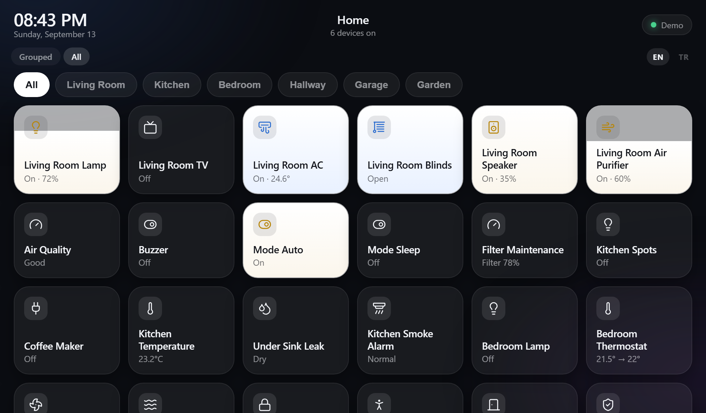
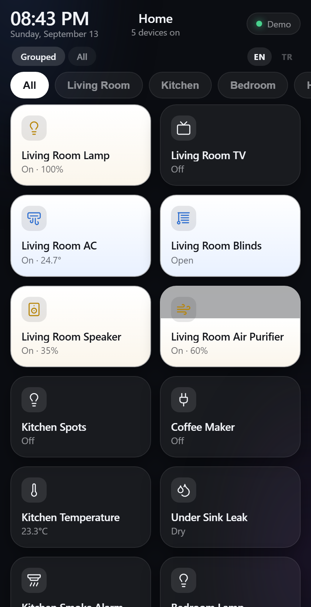
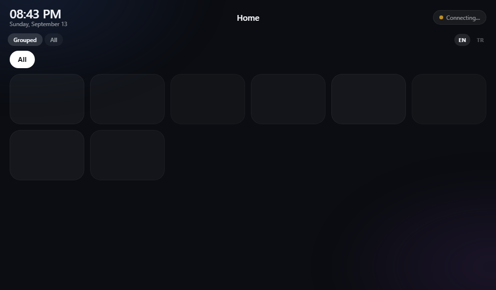
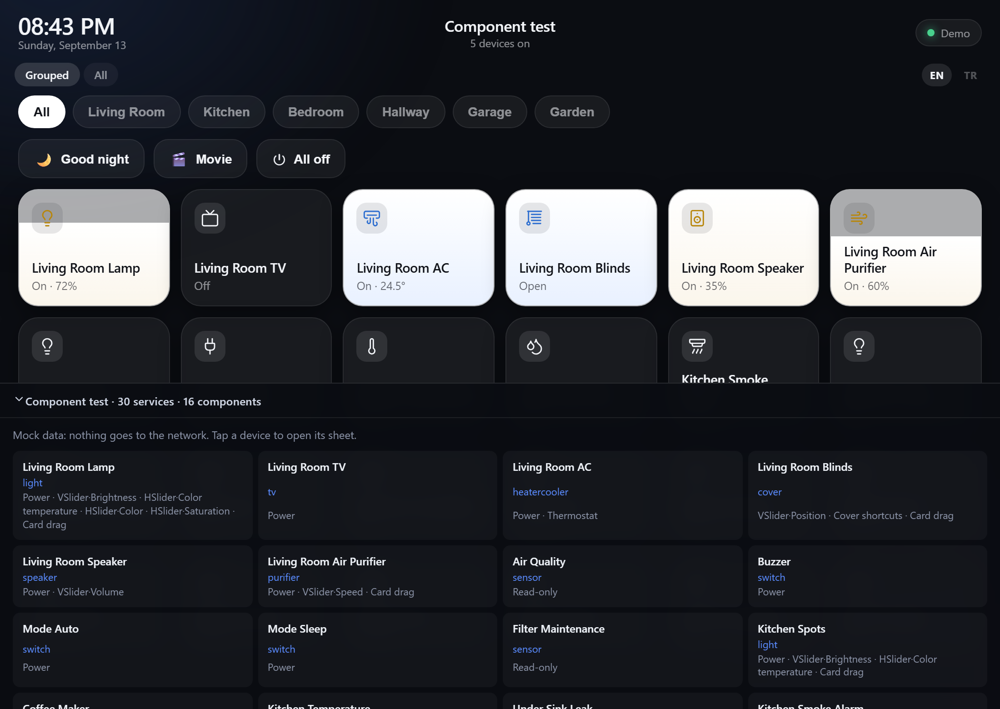

# Homebridge Kiosk

A touch-first wall panel for [Homebridge](https://homebridge.io). Hang a cheap
tablet or a Raspberry Pi screen on the wall, and control your HomeKit devices
without unlocking a phone.

> **This is not a Homebridge plugin.** It's a small standalone server you run
> next to Homebridge. It talks to the Homebridge UI's REST API over your LAN.
> Nothing to install inside Homebridge, and it won't show up in the plugin list.



[](LICENSE)


## Why

The Homebridge UI is an admin tool: great for configuring plugins, wrong for a
wall. This panel does one thing: put every device one touch away, on a screen
nobody is going to log into.

- **Drag a card** to set brightness, fan speed, or blind position
- **Long-press** for the full sheet: colour, colour temperature, thermostat, modes
- **One tile per physical device**, not per HomeKit service (see [Grouping](#grouping))
- Works offline-ish: last known state stays on screen, and the panel tells you
  _why_ it lost the connection
- Light and dark theme, following the device's own setting
- No build server, no cloud, no account. One Node process on your LAN.

## How it compares

|                                                                              |                                                                                                                     |
| ---------------------------------------------------------------------------- | ------------------------------------------------------------------------------------------------------------------- |
| **Homebridge UI's own dashboard**                                            | An admin tool. Needs a login, isn't touch-first. This panel is what you put on the wall instead.                    |
| [homebridge-dashboard](https://github.com/MathisBurger/homebridge-dashboard) | Closest in intent, but a plugin, and no drag sliders or service grouping.                                           |
| [HomeDash](https://www.homedash.app)                                         | Polished, but a closed-source iOS/iPadOS app. This runs in any browser: Pi, old Android tablet, whatever you have. |
| [TouchKio](https://github.com/leukipp/touchkio)                              | Not a competitor; it's the fullscreen kiosk _browser_, which is what `kiosk/pi-kiosk-setup.sh` sets up here.       |

The two things this does that the others don't: [grouping services by physical
device](#grouping), and [drag sliders that don't fight the poll loop](#why-dragging-is-its-own-module).

## Screenshots

| Grouped view                                   | Light theme                                   |
| ---------------------------------------------- | --------------------------------------------- |
|  |  |

| Device sheet                                  | Grouped device sheet                                    |
| --------------------------------------------- | ------------------------------------------------------- |
|  |  |

| Dragging a card                       | Flat view                                |
| ------------------------------------- | ---------------------------------------- |
|  |  |

| Phone width                             | Turkish UI                                        |
| --------------------------------------- | ------------------------------------------------- |
|  |  |

| While connecting                            |
| ------------------------------------------- |
|  |

## Try it in 30 seconds

No Homebridge needed. The mock has at least one fake device of every supported
type:

```bash
npm install
npm run build
npm run mock          # http://localhost:8080
```

## Connect it to Homebridge

```bash
cp .env.example .env  # fill in HB_URL / HB_USERNAME / HB_PASSWORD
npm run build
npm start
```

`npm start` loads `.env` with Node's own `--env-file`; variables already set in
the environment win. Docker and systemd pass the environment themselves.

Two things that will bite you if you skip them:

1. **Turn on accessory control.** Homebridge UI → Settings → _Homebridge
   Accessory Control_ (insecure mode). Without it `/api/accessories` returns
   nothing and the panel shows no devices.
2. **Room layout is stored per user.** Homebridge serves the layout "for the
   authenticating user", so arrange your rooms while logged in as the _same_
   account the panel uses, otherwise you get a single "Other" room.

There is no API key: Config UI X issues a JWT from a username and password, and
the panel refreshes the token itself. The account does **not** need to be an
admin: `GET` and `PUT` on `/api/accessories` have no admin guard. Don't enable
2FA on it, though; password login is the only flow the panel has.

## Put it on a wall

`kiosk/` has both paths:

- **Raspberry Pi + touchscreen** → `sudo bash kiosk/pi-kiosk-setup.sh http://SERVER:8080`
  (fullscreen Chromium, hidden cursor, starts on boot, screen blanking off)
- **An old tablet** → open the URL, "Add to Home Screen", turn on screen pinning.
  It is a PWA, so it runs without browser chrome.

`kiosk/homebridge-kiosk.service` is a systemd unit for the server side.

## Grouping

Homebridge exposes every _service_ as its own accessory. One air purifier can
show up as seven tiles: the purifier, an air-quality sensor, a buzzer switch,
three mode switches, and a filter-maintenance service. On a wall panel that is
noise.

The panel groups services that belong to the same physical device and shows one
tile for it. The extra services move into the sheet under **Other controls**:


Grouping key is `bridge MAC + aid`. `aid` alone is not unique, because every
bridge starts numbering at 1. The "main" service is picked by a type priority
list (a purifier wins over its own buzzer switch).

The `Grouped | All` switch turns it off if you want the raw service list. Bridge
metadata services (`Protocol Information`) are hidden in both views; `?debug=1`
adds a third view that shows them.

## Configuration

All optional except the three Homebridge values.

| Key                           | Default                 | What it does                                        |
| ----------------------------- | ----------------------- | --------------------------------------------------- |
| `HB_URL`                      | `http://localhost:8581` | Homebridge UI address                               |
| `HB_USERNAME` / `HB_PASSWORD` | none                    | Config UI X login                                   |
| `PORT`                        | `8080`                  | Port the panel listens on                           |
| `HB_POLL_INTERVAL`            | `2000`                  | Poll interval while someone is watching (ms)        |
| `HB_IDLE_POLL_INTERVAL`       | `10000`                 | Poll interval with no viewers (ms)                  |
| `KIOSK_TITLE`                 | none                    | Header text; empty shows "Home" in the UI language  |
| `KIOSK_LOCALE`                | none                    | `en-US` / `tr-TR`; empty follows the browser        |
| `KIOSK_THEME`                 | `auto`                  | `dark` / `light`; `auto` follows the device setting |
| `KIOSK_SCREENSAVER_AFTER`     | `120`                   | Seconds before the clock screen (0 = off)           |
| `KIOSK_HIDE_TYPES`            | none                    | Device types to hide, e.g. `Battery,Television`     |
| `KIOSK_ACCESS_CODE`           | none                    | Gates the page, API and WebSocket; `/?code=XXXX`    |
| `HB_MOCK`                     | `0`                     | `1` runs on fake devices, never contacts Homebridge |

### Scenes

Copy `scenes.json.example` to `scenes.json` for one-touch multi-device actions.
Each action is a device id, a characteristic, a value, and an optional delay.
With Docker, mount it into the container: `-v ./scenes.json:/app/scenes.json:ro`.

## Docker

Prebuilt image (amd64 and arm64, so a Raspberry Pi works too):

```bash
docker run -d --name homebridge-kiosk -p 8080:8080 --env-file .env \
  --restart unless-stopped ghcr.io/merloss/homebridge-kiosk:latest
```

Any Docker host or panel (Portainer, Dokploy, Coolify...) can use the same
image: set the variables from `.env.example` in its environment settings and
expose port 8080. `:latest` follows `main`; version tags like `:1.2.3` are
published for releases.

Or build it yourself with compose:

```bash
cp .env.example .env
docker compose up -d
```

The image builds the UI in a first stage, so you don't need Node locally.
Everything in `.env` is passed to the container. The container always listens
on 8080; to use another host port, change the left side of `ports:` in
`docker-compose.yml` rather than `PORT`.

CI builds the image and checks that it serves the panel on every push.

## Development

Two terminals, one for data and one for the UI with hot reload:

```bash
npm run dev:server   # API + fake devices, restarts on change   :8080
npm run dev:ui       # Vite, hot reload                         :5173
```

Open **:5173**. Vite proxies `/api` and `/ws` to the server on :8080, so the UI
reloads on save while the data keeps flowing.

All scripts:

| Script               | What it does                                              |
| -------------------- | --------------------------------------------------------- |
| `npm start`          | Run against real Homebridge (needs `npm run build` first) |
| `npm run mock`       | Same, but on fake devices, no Homebridge required         |
| `npm run build`      | Build the UI into `web/dist`                              |
| `npm run build:demo` | Bundle the whole UI into a single offline `demo.html`     |
| `npm run dev:server` | Server in watch mode, fake devices                        |
| `npm run dev:ui`     | Vite dev server with hot reload                           |
| `npm run inspect`    | Print how your real Homebridge devices get grouped        |
| `npm test`           | Build, then run every test suite in a real Chromium       |
| `npm run screenshots` | Regenerate the images in `docs/screenshots`              |

### Tests

```bash
npx playwright install chromium   # once
npm test
node test/run.mjs panel theme      # only some suites (after npm run build)
```

The suites drive a real Chromium through Playwright, because the bugs a touch
panel has live in exactly what a fake DOM fakes: pointer capture, layout and
touch-action. The runner starts its own servers on ports 8765-8768 (move them
with `TEST_PORT=9100`), so a panel already running on 8080 is left alone, and it
ignores your `.env`.

| Suite            | What it covers                                                  |
| ---------------- | --------------------------------------------------------------- |
| `panel`          | Card drag, release, sheet sliders, touch input, alarm, garage   |
| `grouping`       | Grouping, Grouped / All, other controls, `?debug=1`, type coverage |
| `i18n`           | Browser language, EN / TR switch, persistence, untranslated keys |
| `component-page` | `/test.html` opens every sheet and never touches the network    |
| `loading`        | No false "can't reach" or "no devices" before the first data    |
| `reload`         | F5 never flashes the error bar                                  |
| `theme`          | Follows the device before first paint and live; `KIOSK_THEME`   |
| `access-code`    | The code gates HTTP **and** the WebSocket; the cookie is HttpOnly |
| `blink`          | A server restart stays quiet, a real outage does not            |
| `failures`       | Device removed, write fails, Homebridge down and back (fake Homebridge) |
| `flicker`        | A light that reports its state late does not flash off          |

GitHub Actions runs the same `npm test` on every push and pull request.

### Component test page

`http://SERVER:8080/test.html` is the whole panel running on **mock data with no
network access at all**. It works even while the server is talking to a real
Homebridge, so you can exercise every component without touching real devices.



The bar at the bottom lists every mock service; clicking one opens its sheet and
tells you which components it exercises. The mock data has a single source
(`server/mock.js`), shared by `--mock` mode and this page, so the two can't
drift apart.

## Architecture

```
server/
  index.js         HTTP + WebSocket server, Homebridge polling, writes
  access.js        access code for pages, API and WebSocket
  config.js        settings from environment variables
  homebridge.js    Config UI X client (login, token refresh, writes)
  normalize.js     raw accessories -> device model, grouping
  mock.js          fake Homebridge with every device type
  demo.js          offline state for the test page and the demo build
shared/            constants used by both sides
web/src/
  lib/
    store.js       device state, merging, writes (framework-free)
    connection.js  WebSocket with a REST fallback
    holds.js       ignores stale server values while you drag (see below)
    device.js      status text, fill level, value formatting
    i18n.js        every visible string
    theme.js       light / dark
  hooks/           store subscriptions, slider drag, clock, screensaver
  components/      Tile, DeviceIcon (lucide), sliders, top bar, sheet/
test/
  run.mjs          starts the servers, runs the suites
  suites/          one file per behaviour (see Tests)
  fake-homebridge.mjs  a Config UI X that can drop devices, fail writes, go down
```

The server sends **raw values only**, no display strings. All user-visible text
is produced in the browser, in the selected language. (It used to be computed in
both places, and the twin implementations drifted.)

Tiles subscribe **per device**, not to the whole store, so dragging one slider
re-renders one component instead of the entire panel. That matters on the weak
hardware this is meant to run on.

### Why dragging is its own module

`holds.js` is the least obvious and most important file. A slider drag fights
the poll loop: the server's values are always a few hundred milliseconds behind
your finger, so naively applying them yanks the value backwards mid-drag.

Every characteristic the panel writes is "held" for a moment: indefinitely
while a finger is down, then briefly after release. Incoming values for a held
characteristic are ignored; as soon as the server echoes back the value we
wrote, the hold clears and the panel follows the server again. A write that
_fails_ clears the hold and pulls fresh state, because the server will never
send a correction for a value that never changed on its side.

It is framework-free so it can be reasoned about and tested on its own.

### "Connecting" is a state, not an error

The store starts out knowing nothing, and the UI must not mistake that for a
failure. `ready` answers _"have we heard from the panel server at least once?"_,
which is a different question from _"is Homebridge up?"_. Until it flips, the panel
shows skeleton tiles and an amber "Connecting…", and suppresses the error bar,
the empty state and the "everything off" summary. All three of those would
otherwise be confident lies for the first second of a cold start.

If the panel server itself is unreachable, a 6-second failsafe flips `ready`
anyway, so a real problem still surfaces instead of spinning forever.

Two more cases where the panel deliberately keeps quiet:

- **The page is unloading.** On F5 or closing the tab the socket closes, and the
  outgoing document would re-render as offline on its way out. `pagehide` stops
  the store from touching state. `pageshow` undoes it, because `pagehide` also fires
  when a page enters the back/forward cache, and that page can come back, so
  without the second half a restored panel would sit there with a dead socket.
- **A blink.** A socket that drops and returns inside ~1.2s is not an outage.
  Reconnection starts immediately; the error bar waits out the grace period. An
  outage that actually lasts still shows up, which is what the test asserts.

### Derived fields live in exactly one place

`active`, `alert` and the status line are all derived from a device's `values`.
The server sends **raw values only** and the client derives them on every merge.

That rule exists because breaking it caused a real bug: the server's optimistic
patch updated `values` but left a stale `active` behind, so a light you had just
switched on flashed off for a moment and then came back. Related: an optimistic
patch never clears a hold, since it is our own write echoed back, not confirmation
from the device.

## Language

The UI ships in English and Turkish. It follows the browser language, with an
`EN | TR` switch in the panel and `?lang=en` / `?lang=tr` for pinning; the
choice is remembered. `KIOSK_LOCALE` pins a wall panel to one language.

Adding a language means adding one dictionary to `web/src/lib/i18n.js`; there
are no strings anywhere else. Translations welcome.

## Contributing

Issues and pull requests are welcome. If you're adding device support, extend
`server/mock.js` with a fixture first. The mock is what the tests and the
component page run on, and a whole class of bug got missed here because the
mock didn't look enough like real Homebridge data. Run `npm test` before
opening a pull request; CI runs it too.

## License

[MIT](LICENSE)
